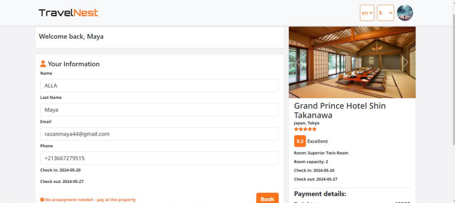

<div align="center">

# 🏨 Hotel Booking Website

A full-stack hotel reservation platform developed as a Bachelor's Final Year Project at **USTHB**.

Search hotels • Book rooms • Manage reservations • Hotel dashboards • Admin panel


</div>

---

# 📖 Overview

Hotel Booking Website is a web application that allows customers to search, compare and reserve hotel rooms online while providing dedicated management interfaces for hotel owners and administrators.

The project was designed using UML before implementation and follows a classic client-server architecture using PHP and MySQL.

---

# ✨ Main Features

## 👤 Visitors

- Search hotels
- Filter hotels
- Sort search results
- View hotel details
- View room details
- View hotel location
- Change currency
- Change language

---

## 👥 Customers

- Create an account
- Secure authentication
- Email verification
- Book hotel rooms
- Cancel reservations
- Reservation history
- Manage profile
- Change password
- Leave ratings and reviews

---

## 🏨 Hotel Managers

- Hotel management
- Room management
- Availability management
- Reservation management
- Account management

---

## ⚙️ Administrators

- Dashboard
- Customer management
- Hotel manager management
- Hotel management
- Comments moderation
- Currency management
- Language management
- Reservation monitoring

---

# 🛠️ Technologies

## Frontend

- HTML5
- CSS3
- Bootstrap
- JavaScript
- Fetch API
- Sass
- Font Awesome

## Backend

- PHP

## Database

- MySQL

## Development Environment

- Apache
- XAMPP
- Visual Studio Code

## External APIs

- CurrencyFreaks API
- MyMemory Translation API

---

# 🗄️ Database

Main entities include:

- Hotel
- Room
- Customer
- Reservation
- Country
- City
- Language
- Currency
- Comments
- Hotel Images
- Room Images
- Hotel Manager

---


# 🚀 Installation

## Clone the repository

```bash
git clone https://github.com/yourusername/Hotel-Booking-Website.git
```

---

## Move the project

Copy the project into

```
xampp/htdocs/
```

---

## Start the server

Open **XAMPP**

Start

- Apache
- MySQL

---

## Create the database

Open **phpMyAdmin**

Create a database.

Import

```
db.sql
```

If necessary, also import

```
contraystate.sql
```

---

## Configure the connection

Open

```
db.php
```

Update the database credentials.

Example

```php
$host = "localhost";
$user = "root";
$password = "";
$database = "hotel_booking";
```

---

## Run the application

```
http://localhost/Hotel-Booking-Website/
```

---

# 🖥️ Application Preview

## Home Page

<p align="center">

</p>

---

## Hotel Search

<p align="center">

</p>

---

## Hotel Details

<p align="center">

</p>

---

## Reservation

<p align="center">

</p>

---

## Administrator Dashboard

<p align="center">

</p>

---

## Hotel Manager Dashboard

<p align="center">

</p>

---

# 📈 UML Design

The system was designed using UML and includes:

- Use Case Diagrams
- Class Diagram
- Sequence Diagrams
- Relational Database Model

---

# 🔒 Non-functional Requirements

- Secure authentication
- Responsive interface
- Maintainable code
- Reliable reservation system
- Fast search
- User-friendly interface

---

# 🚀 Future Improvements

- Online payment gateway
- Social login
- Email notifications
- Mobile application
- Recommendation system
- AI-powered hotel recommendations
- Arabic language support

---

# 👨‍💻 Authors

**Farah Zenaini**

Bachelor's Final Year Project

University of Science and Technology Houari Boumediene (USTHB)

2024

---

# ⭐ Support

If you like this project, consider giving it a ⭐ on GitHub.

---

# 📄 License

This project was developed for educational purposes.
